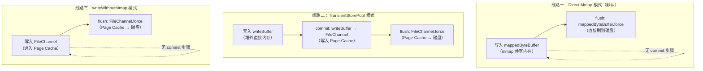
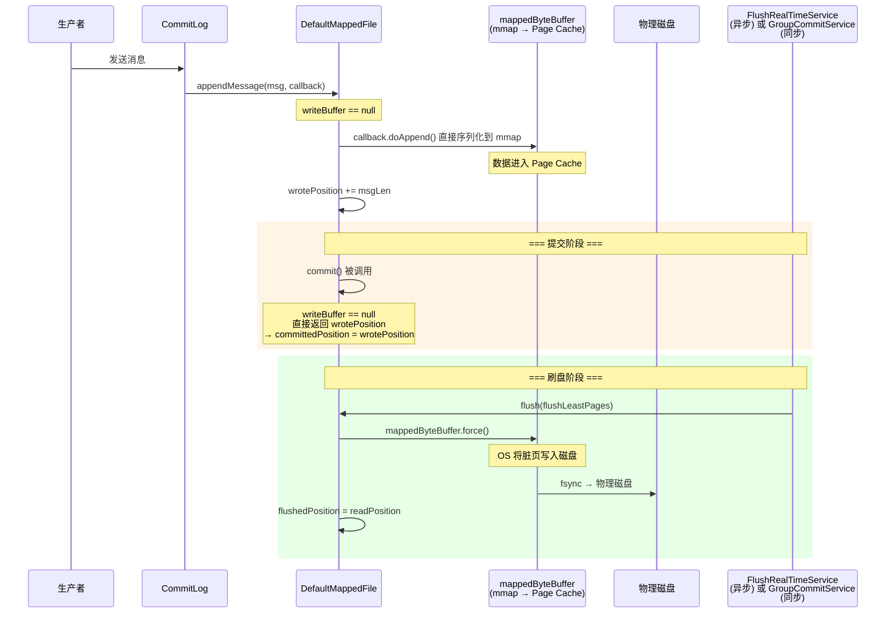
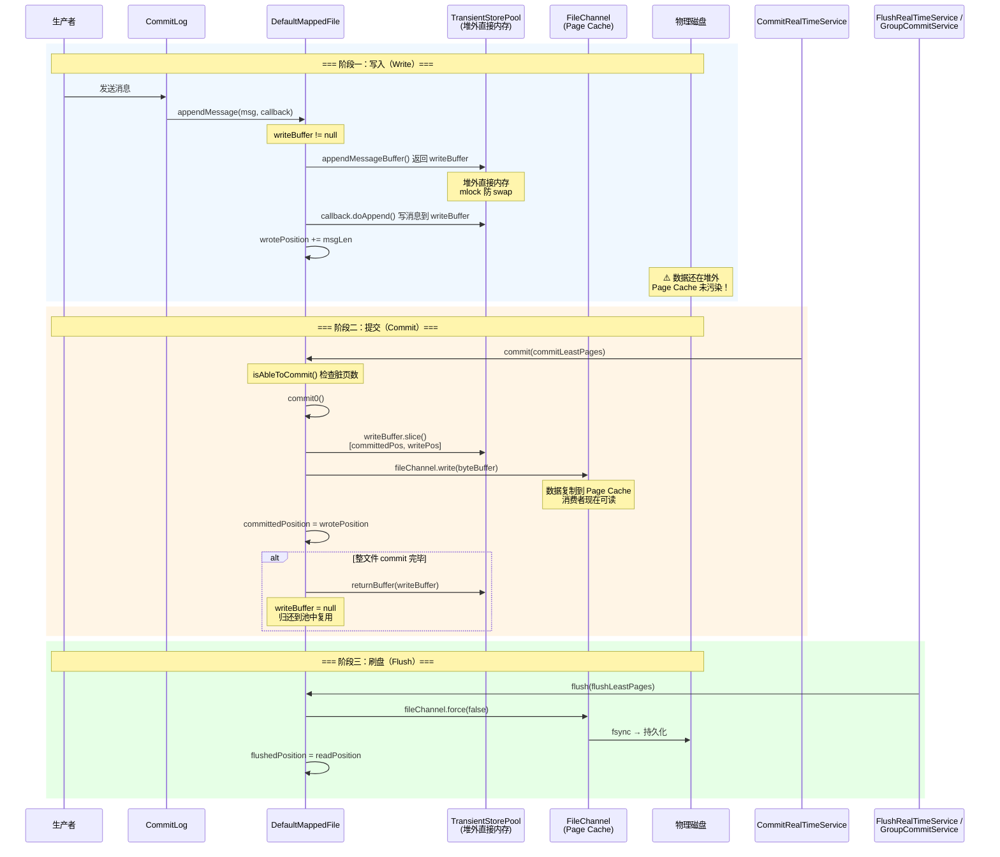
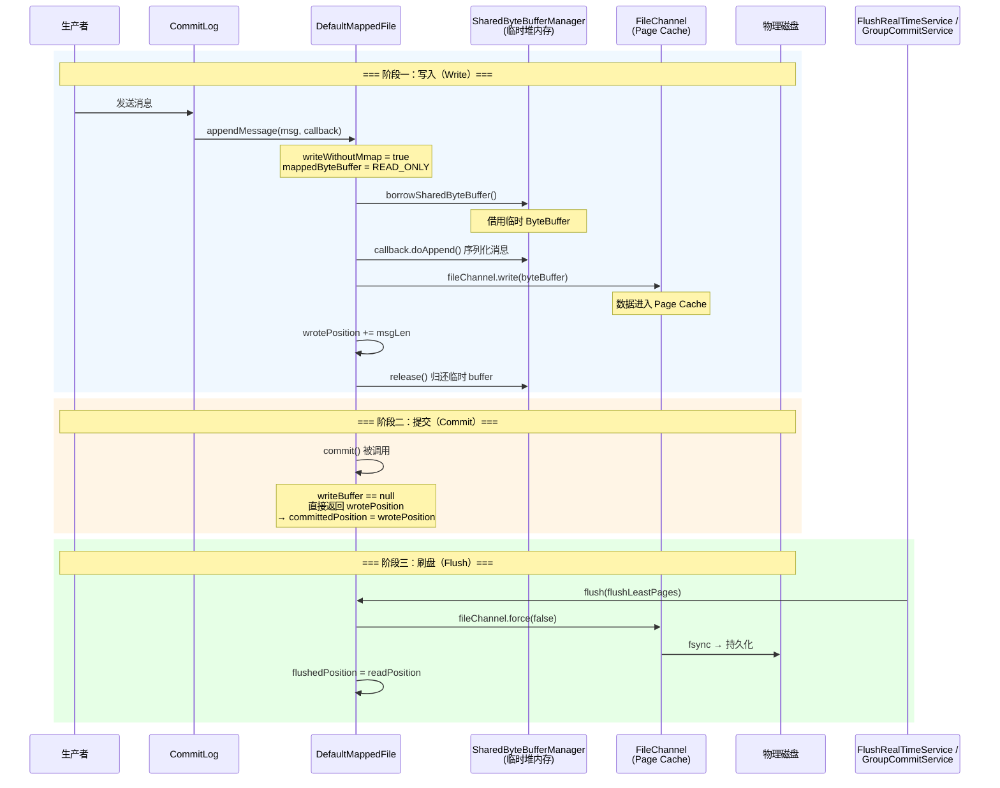
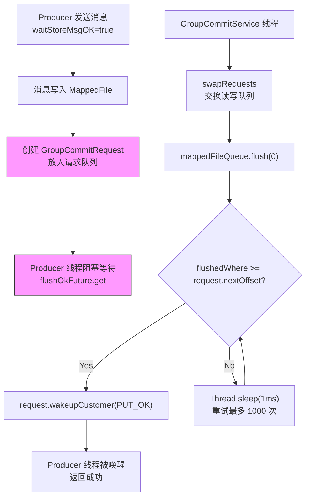
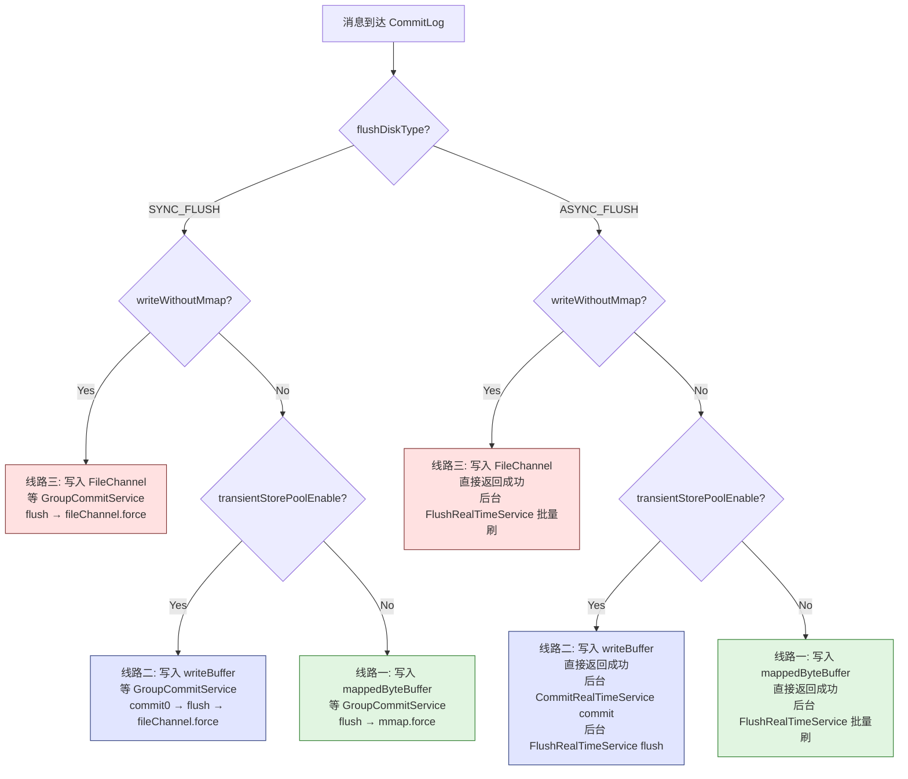

# RocketMQ MappedFile 三种写入、提交、刷盘方式详解


## 一、前置概念：数据持久化的三层缓冲

在理解 MappedFile 的三条线之前，先搞清楚操作系统和 JVM 中的数据流动层级：

```
[应用层]  →  [JVM 堆外/Page Cache]  →  [物理磁盘]
```

| 层级 | 说明 | 速度 | 持久性 |
|------|------|------|--------|
| **应用层（直接内存 / mmap）** | 数据写入 ByteBuffer，CPU 直接操作 | 极快 | 重启丢失 |
| **页缓存（Page Cache）** | OS 内核管理的磁盘缓存，FileChannel 落于此 | 快 | OS 崩溃丢失 |
| **物理磁盘** | 磁道 / NAND 上的实际数据 | 最慢 | 永久保存 |

MappedFile 的三种方式对应数据在这三层之间**如何流动**和**何时跨越层级**。

---

## 二、MappedFile 的三个关键指针

`DefaultMappedFile` 维护三个**原子更新的位置指针**（源码位置：`DefaultMappedFile.java:80-82`）：

```java
protected volatile int wrotePosition;      // 写入位置 — "我写到了哪里"
protected volatile int committedPosition;  // 提交位置 — "我提交到了哪里"
protected volatile int flushedPosition;    // 刷盘位置 — "我刷到了哪里"
```

**始终满足**：`flushedPosition ≤ committedPosition ≤ wrotePosition ≤ fileSize`

其中 `getReadPosition()` 决定了**消费者能读到什么地方**的数据（源码 `DefaultMappedFile.java:787-789`）：

```java
public int getReadPosition() {
    // 如果用 TransientStorePool 但不做真实 commit，可读 = wrote
    // 否则可读 = committed（必须 commit 到 FileChannel 消费者才能读）
    return transientStorePool == null || !transientStorePool.isRealCommit()
        ? wrotePosition : committedPosition;
}
```

---

## 三、三条线路总览



### 一句话概括

| 线路 | 写入目标 | 是否有 commit | flush 方式 | 适用场景 |
|------|----------|:---:|------------|----------|
| **线路一** | `mappedByteBuffer` (mmap) | ❌ 无 | `mappedByteBuffer.force()` | 标准部署 |
| **线路二** | `writeBuffer` (堆外内存池) | ✅ 有 | `fileChannel.force(false)` | SSD / 高吞吐 |
| **线路三** | `fileChannel.write()` | ❌ 无 | `fileChannel.force(false)` | mmap 受限环境 |

---

## 四、线路一：Direct Mmap 模式（默认模式）

### 4.1 触发条件

- **没有**启用 `TransientStorePool`（`writeBuffer == null`）
- **没有**设置 `writeWithoutMmap = true`

### 4.2 初始化

`DefaultMappedFile.init()` (`DefaultMappedFile.java:199-234`) 中，用 `FileChannel.map(MapMode.READ_WRITE, 0, fileSize)` 将文件直接映射到虚拟内存地址，得到一个 `mappedByteBuffer`。

**关键**：这个 `mappedByteBuffer` **直接对应文件的 Page Cache**——写 mappedByteBuffer 就是写 Page Cache，OS 会在后台异步刷到磁盘。

### 4.3 写入流程

消息写入时（`appendMessagesInner`，`DefaultMappedFile.java:351-422`）：

```java
// appendMessageBuffer() 返回 mappedByteBuffer
protected ByteBuffer appendMessageBuffer() {
    return writeBuffer != null ? writeBuffer : this.mappedByteBuffer;
}
```

`writeBuffer == null`，所以返回 `mappedByteBuffer`。回调 `cb.doAppend()` 直接在 mmap 内存中序列化消息，然后原子更新 `wrotePosition`。

### 4.4 Commit 流程

**没有 commit 步骤**。`commit()` 方法检测到 `writeBuffer == null` 直接返回 `wrotePosition`（源码 `DefaultMappedFile.java:562-566`）：

```java
public int commit(final int commitLeastPages) {
    if (writeBuffer == null) {
        // 不需要 commit，wrote 即 committed
        return WROTE_POSITION_UPDATER.get(this);
    }
    // ...
}
```

### 4.5 Flush 流程

`flush()` 方法调用 `mappedByteBuffer.force()`（源码 `DefaultMappedFile.java:526-559`）：

```java
public int flush(final int flushLeastPages) {
    // ...
    if (writeWithoutMmap || writeBuffer != null || this.fileChannel.position() != 0) {
        this.fileChannel.force(false);   // 线路二/三走这里
    } else {
        this.mappedByteBuffer.force();   // 线路一走这里！
    }
    // ...
}
```

### 4.6 流程图



### 4.7 优缺点

| 优点 | 缺点 |
|------|------|
| ✅ 零拷贝读取（消费者直接读 Page Cache） | ❌ Page Cache 被写入污染，读缓存命中率降低 |
| ✅ 简单，代码路径最短 | ❌ 大量写入会频繁触发 OS 脏页回写 |
| ✅ 适合机械硬盘和一般 SSD | ❌ mmap 数量有限制（受虚拟地址空间限制） |

---

## 五、线路二：TransientStorePool 模式（高性能模式）

### 5.1 核心思想

**写和读分离**：
- **写** → `writeBuffer`（从 `TransientStorePool` 借的堆外直接内存），**不经过 Page Cache**
- **commit** → 把 `writeBuffer` 的数据复制到 `FileChannel`（进入 Page Cache）
- **读** → 从 `FileChannel` / `mappedByteBuffer` 读（此时数据已 commit 到 Page Cache）
- **flush** → `FileChannel.force(false)` 将 Page Cache 刷到磁盘

### 5.2 为什么这么设计？

RocketMQ 的一大性能瓶颈是 **Page Cache 污染**。如果直接 mmap 写入：
- 大量写入数据占据 Page Cache
- 消费者读取历史消息时，Page Cache 被写入数据"挤掉"，命中率极低
- 读取变成磁盘 IO，延迟飙升

`TransientStorePool` 用**堆外直接内存**作为写入缓冲区，写入不污染 Page Cache。只有 commit 后数据才进入 Page Cache，而 Page Cache 此时只服务于消费者读取。

### 5.3 触发条件

- `transientStorePoolEnable = true`
- `TransientStorePool` 不为 `null` → `writeBuffer != null`

### 5.4 初始化

`TransientStorePool.init()` 预分配 N 个 `ByteBuffer.allocateDirect(fileSize)` 的堆外内存块，并 `mlock` 锁在物理内存中防止被 swap（`TransientStorePool.java:48-58`）：

```java
public void init() {
    for (int i = 0; i < poolSize; i++) {
        ByteBuffer byteBuffer = ByteBuffer.allocateDirect(fileSize);
        final long address = PlatformDependent.directBufferAddress(byteBuffer);
        LibC.INSTANCE.mlock(pointer, new NativeLong(fileSize));  // 锁定物理页
        availableBuffers.offer(byteBuffer);
    }
}
```

`DefaultMappedFile.init()` 中从池中借一块（`DefaultMappedFile.java:190-196`）：

```java
if (transientStorePool != null) {
    this.writeBuffer = transientStorePool.borrowBuffer();
    this.transientStorePool = transientStorePool;
}
```

### 5.5 写入流程

`appendMessageBuffer()` 因 `writeBuffer != null` 返回 `writeBuffer`：

```java
protected ByteBuffer appendMessageBuffer() {
    return writeBuffer != null ? writeBuffer : this.mappedByteBuffer;
}
```

消息序列化到**堆外直接内存**的 `writeBuffer`，**完全绕过 Page Cache**。CPU 透过 DMA 直接操作这块内存。

### 5.6 Commit 流程

commit 是这条线的**核心步骤**。由 `CommitRealTimeService`（`CommitLog.java:1493`）定时驱动，调用 `commit0()`（`DefaultMappedFile.java:589-605`）：

```java
protected void commit0() {
    int writePos = WROTE_POSITION_UPDATER.get(this);
    int lastCommittedPosition = COMMITTED_POSITION_UPDATER.get(this);

    if (writePos - lastCommittedPosition > 0) {
        ByteBuffer byteBuffer = writeBuffer.slice();
        byteBuffer.position(lastCommittedPosition);
        byteBuffer.limit(writePos);
        this.fileChannel.position(lastCommittedPosition);
        this.fileChannel.write(byteBuffer);   // 复制到 Page Cache
        COMMITTED_POSITION_UPDATER.set(this, writePos);
    }
}
```

**关键细节**：当整个文件都 commit 完毕后，`writeBuffer` 会归还 `TransientStorePool` 复用（`DefaultMappedFile.java:581-583`）：

```java
if (writeBuffer != null && this.transientStorePool != null
    && this.fileSize == COMMITTED_POSITION_UPDATER.get(this)) {
    this.transientStorePool.returnBuffer(writeBuffer);
    this.writeBuffer = null;  // 归还后 writeBuffer 置 null
}
```

`isRealCommit` 参数控制 commit 的语义（`DefaultMappedFile.java:568-570`）：
- `isRealCommit = false`：不实际 commit，只更新 `committedPosition = wrotePosition`（提高 consumer 可读性）
- `isRealCommit = true`（默认）：真实将数据从 `writeBuffer` 写入 `FileChannel`

### 5.7 Flush 流程

`flush()` 检测到 `writeBuffer != null`，走 `fileChannel.force(false)`：

```java
if (writeWithoutMmap || writeBuffer != null || this.fileChannel.position() != 0) {
    this.fileChannel.force(false);   // 将 Page Cache 刷到磁盘
}
```

`force(false)` 的含义：`false` = 只刷文件内容，不刷元数据（修改时间等），性能更好。

### 5.8 完整流程图



### 5.9 优缺点

| 优点 | 缺点 |
|------|------|
| ✅ 写入不污染 Page Cache，读缓存命中率高 | ❌ 需要额外堆外内存（`poolSize × fileSize`，如 5 × 1G = 5GB） |
| ✅ 堆外内存无 GC 压力 | ❌ 多一次内存复制（writeBuffer → FileChannel） |
| ✅ 适合大吞吐 SSD 场景 | ❌ 架构更复杂 |

---

## 六、线路三：writeWithoutMmap 模式

### 6.1 触发条件

- `writeWithoutMmap = true`

### 6.2 为什么需要？

某些环境下 mmap 不可靠或受限：
- **Windows 平台**：mmap 后无法 rename/delete 文件（JDK bug JDK-4724038）
- **容器环境**：虚拟地址空间受限
- **某些 JDK 版本**：MappedByteBuffer 的 `isLoaded0` 在 Windows 上始终返回 false

### 6.3 初始化

（`DefaultMappedFile.java:209-218`）：

```java
if (writeWithoutMmap) {
    // mmap 只读 — 仅用于消费者读取
    this.mappedByteBuffer = this.fileChannel.map(MapMode.READ_ONLY, 0, fileSize);
} else {
    // 默认：mmap 读写
    this.mappedByteBuffer = this.fileChannel.map(MapMode.READ_WRITE, 0, fileSize);
}
```

**重点**：`mappedByteBuffer` 是 **READ_ONLY** 的，只能用于读取。写入必须走 `FileChannel`。

### 6.4 写入流程

`appendMessagesInner` 中检测到 `writeWithoutMmap`，使用 `SharedByteBufferManager` 借临时 buffer，序列化后通过 `fileChannel.write()` 写入（`DefaultMappedFile.java:362-409`）：

```java
if (writeWithoutMmap) {
    sharedByteBuffer = SharedByteBufferManager.getInstance().borrowSharedByteBuffer();
    byteBuffer = sharedByteBuffer.acquire();
    // ... 序列化到 byteBuffer ...
    this.fileChannel.position(currentPos);
    this.fileChannel.write(byteBuffer);  // 写入 Page Cache
}
```

同时还会做**页对齐**填充（`DefaultMappedFile.java:391-394`），防止脏数据被读到。

### 6.5 Commit 流程

**没有 commit 步骤**。和线路一一样，`writeBuffer == null`，所以 `commit()` 直接返回 `wrotePosition`。

数据已经通过 `fileChannel.write()` 进入了 Page Cache，可以直接被 flush。

### 6.6 Flush 流程

`flush()` 中 `writeWithoutMmap` 为 `true`，走 `fileChannel.force(false)`：

```java
if (writeWithoutMmap || writeBuffer != null || this.fileChannel.position() != 0) {
    this.fileChannel.force(false);
}
```

### 6.7 流程图



### 6.8 优缺点

| 优点 | 缺点 |
|------|------|
| ✅ 避免 mmap 的平台兼容性问题 | ❌ 写入需要额外借 buffer，多一次内存分配 |
| ✅ 文件 rename/delete 不受 mmap 锁阻碍 | ❌ 读取仍用 mmap，写用 FileChannel，两套机制 |
| ✅ 写入 FileChannel 位置显式可控 | ❌ 不适合高性能场景 |

---

## 七、三种刷盘策略的调度

以上三条线路描述的是**数据怎么流**，而**什么时候流**由刷盘策略决定。

### 7.1 同步刷盘 (SYNC_FLUSH)

使用 `GroupCommitService`，生产者线程阻塞等待刷盘完成：



### 7.2 异步刷盘 (ASYNC_FLUSH)

使用 `FlushRealTimeService`，定时批量刷盘。生产者**不等**刷盘完成直接返回。

### 7.3 Commit 调度（仅线路二）

当启用 `TransientStorePool` 时，`CommitRealTimeService` 在后台定时执行 commit。

---

## 八、配置参数速查

| 参数 | 默认值 | 说明 |
|------|--------|------|
| `flushDiskType` | `ASYNC_FLUSH` | `SYNC_FLUSH` 同步刷盘 / `ASYNC_FLUSH` 异步刷盘 |
| `transientStorePoolEnable` | `false` | 启用 TransientStorePool（线路二） |
| `transientStorePoolSize` | `5` | 堆外内存池大小（文件数） |
| `writeWithoutMmap` | `false` | 启用 writeWithoutMmap 模式（线路三） |
| `commitIntervalCommitLog` | `200`ms | commit 间隔 |
| `commitCommitLogLeastPages` | `4` 页 | 最少脏页数才 commit |
| `flushIntervalCommitLog` | `500`ms | 异步刷盘间隔 |
| `flushCommitLogLeastPages` | `4` 页 | 最少脏页数才刷盘 |
| `syncFlushTimeout` | `5000`ms | 同步刷盘超时 |

---

## 九、完整决策树



| 颜色 | 线路 | 特点 |
|:---:|------|------|
| 🟩 绿色 | **线路一**：Direct Mmap | 默认模式，写 mappedByteBuffer，无 commit，最简单 |
| 🟦 蓝色 | **线路二**：TransientStorePool | 写堆外内存 → commit → flush，Page Cache 无污染，性能最高 |
| 🟥 红色 | **线路三**：writeWithoutMmap | 写 FileChannel，mmap 只读，兼容性最好 |

---

## 十、源码关键路径索引

| 功能 | 文件 | 方法/行号 |
|------|------|-----------|
| writeBuffer 分配 | `TransientStorePool.java:48-58` | `init()` |
| writeBuffer 借用 | `DefaultMappedFile.java:190-196` | `init()` |
| 写入消息 | `DefaultMappedFile.java:351-422` | `appendMessagesInner()` |
| appendMessageBuffer 路由 | `DefaultMappedFile.java:423-426` | `appendMessageBuffer()` |
| commit | `DefaultMappedFile.java:562-587` | `commit()` |
| commit0（真实写入 FileChannel） | `DefaultMappedFile.java:589-605` | `commit0()` |
| flush | `DefaultMappedFile.java:526-559` | `flush()` |
| getReadPosition | `DefaultMappedFile.java:787-789` | `getReadPosition()` |
| CommitRealTimeService | `CommitLog.java:1493-1546` | 定时 commit 调度 |
| FlushRealTimeService | `CommitLog.java:1548-1632` | 异步 flush 调度 |
| GroupCommitService | `CommitLog.java:1675-1781` | 同步 flush 调度 |
| 刷盘策略路由 | `CommitLog.java:2184-2275` | `DefaultFlushManager` |

---

## 十一、一句话总结

| 问题 | 答案 |
|------|------|
| **为什么有三条线？** | 写入目标不同：mmap 直接写 Page Cache（线一）、堆外内存隔离写（线二）、FileChannel 兼容写（线三） |
| **为什么需要 commit？** | 仅线二需要——数据先写堆外内存，commit 是"将堆外内存复制到 Page Cache"那一步，让消费者可见 |
| **flush 到底做了什么？** | 调用 OS 的 `fsync` 系统调用，将 Page Cache 中的脏页强制写入物理磁盘 |
| **怎么选？** | 默认用线一；SSD + 高吞吐用线二（+200MB~2GB 堆外内存）；mmap 兼容问题用线三 |
